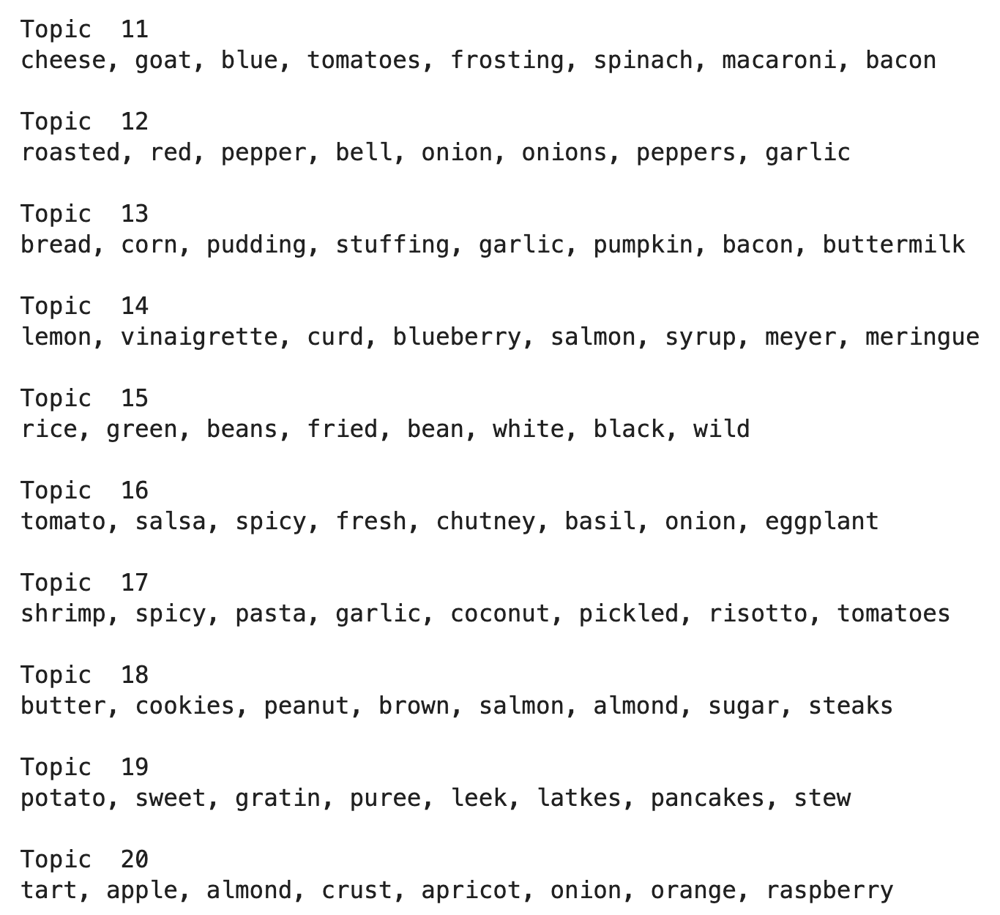

# PROJECT Report 

**Focus:** Image  Classification (w/ CNN), Text Classification (w/ NLP), Data Engineering, and _Design-to-Product_ Pipeline

------

> **Problem Statement:** 
>
> - What dish can I cook tonight, using the ingredients I have in my refrigerator? 

  

### Project Description

On a weekly basis, I spend a lot time **looking** for recipes that would match the ingredients I have in my refrigerator. Typically I spend ~30 minutes just google searching and browsing different websites for the perfect recipe that contains matching ingredients, the least amount of prep time, good nutritonal values, etc. I've also explored cooking websites and apps to help me find a matching recipe. However, I still have to spend some time with typing-in the ingredients, choosing dish types, and navigating through different functionalities. I thought, *"Wouldn't it be nice to have a personalized recipe-finder app that simply takes ingredient photos as the input ?"* So i decided to try to build one from scratch.

**Objectives:**

- [x] Collect recipes (text data) by webscraping _Epicurious_. Scraped info includes recipe title, -ingredients, -instructions, nutritional values, and photos  
- [x] Collect images using Google API, for training a CNN model    
- [x] Build a neural network-based image classifier of produce
- [x] Perform topic modeling analysis for recipe-tagging, i.e., grouping them into different dish categories  
- [x] Build a Flask app and a script that runs on a cellphone

  

### Methodology: data acquisition, pre-processing, and modeling

- Using `google-image-download` (API), I collected 300 images for each of the 15 classes of produce (a total of ~4500 images). I then manually inspected each image to make sure that I collected the right type of produce. For example, I wouldn't want to use _mashed potatoes_ when I'm training my model with images of (raw) *potatoes*. I finally ended up using 12 classes (120 images for each), because there were lots of "junk", unrelated images.

- I webscraped epicurious for recipe ingredients, titles, instructions, nutritional values, photos, and (if any) categorical tags.

- To help me choose the suitable architecture for transfer learning, I wrote a Python script that runs and finds the best combination of models, classifier functions, and optimizers. The best combination uses *MobileNetV2* architecture, *rmsprop* optimizer and *softmax* activation function. *MobileNetV2* and *Xception* are the two best CNN architectures to use in this case (**Table 1**).  

  

  **Table 1.** Top-5 best performing models, activation functions and optimizers, based on classification accuracy of images in the validation set.

- I wrote a couple of python scripts containing various helper functions to help me manage image- and text data. One of these scripts allowed me to find the overlap of ingredients (intersections) in the recipes. This way, the app user could choose a recipe that uses all 3 ingredients, or only 2, or even 1 of the ingredients. 

- I used 20-component NMF to do topic modeling on recipe titles. The goal was to tag each recipe into one of 5 main categories, i.e., main dish, side dish, salad, dessert, and condiments. This way, the user would be able choose specifically what kind of recipes to find. 

- I built a Flask app that can be accessed locally (also remotely). To run the app on a cellphone, a user needs to take 3 photos with a cellphone, and email them to produce2recipe@yahoo.com. To get the result of image classification and matched recipes, the user would then use a browser to go on the flask app. (see below for explanation of how I created a workflow to live-demo this phone app).

### Methodology: live-access of flask app using a mobile phone     

To simulate a functioning phone app. I did 3 things:

- Ran the flask app locally on my Mac

- Used `ngrok` so that the app can be accessed remotely through my phone

- On my app's `api.py` file, I included a line of code that runs an apple script to do the following:

  - Delete all images in 'test'-folder,

  - Go to my `mail` inbox (produce2recipe@yahoo.com) and collect new messages, 

  - Find a message that contains image (attachment) and download them,

  - Then, transfer these images to the 'test' folder, and

  - Go back to the api and run the feature extractor and classifier       

       

### Result of image classification and topic modeling    

- My image classifier uses transfer learning with Google's [MobileNet_V2 architecture](https://ai.googleblog.com/2018/04/mobilenetv2-next-generation-of-on.html), which is pretty robust and light! I was able to get upwards of 96% accuracy (**Fig. 1**) after training the top-layer with images of produce.

   

  **Figure 1**. Learning curves for MobileNet_V2 model 

- The top-8 keywords appearing in my 20 topics also seem reasonable (**Fig. 2**). However, to make things simpler, I grouped many of them together so I'd end up with 5 main dish-type categories. 

  

  

  **Figure 2.** Top-8 keywords in each of the 20 topics obtained through NMF of recipe title's *bag of words*.

  

     

> **Problem Solution:**
>
> - What dish can I cook tonight, using the ingredients I have in my refrigerator? I could now use Produce2Recipe to find matching recipes! This way I could spend more time Cooking, not Looking!      

### Future work

- *Larger database and broader scope*. Epicurious only has ~38k recipes on its database, and many of them are missing some info that I wanted for my project (like nutritional values). In the future, I'd like to webscrape several websites and build a bigger recipe-corpus.  Additionally, I've only built a model that classifies 12 different vegetables, which I'd typically have in my refrigerator now and then. Considering that my accuracy is ~96% for these 12 classes, I'd like to add more classes and classify other vegetables, as well as fruits. Furthermore, I'd like to incorporate a personalization option of categorizing recipes that follow a ketogenic diet (based on nutrient content ratios); I had started and even finished making a subfunction for it, I but decided to abandon it to make the product demo simpler. 

- *Topic modeling improvement* . Although the top 8 keywords that appear in each topic seem reasonable, some of the recipes seem to be miscategorized. For example, _marinara sauce_ is considered as a dessert (in the same way as apple sauce is). I may need to consider a [food2vec](https://jaan.io/food2vec-augmented-cooking-machine-intelligence/)-like embedding to resolve this issue. Alternatively, I could increase the number of components in the NMF model, or  try other methods like LSA or LDA. 

-  *Real-time video detection*. At some point, it would be nice to incorporate live-video feed into the image classifier. Perhaps I need to start with Google's [TensorflowLite](https://www.tensorflow.org/lite)  platform and build on top of it.    

- *Automated recipe generation*. I had started training an RNN (LSTM) model to generate salad recipes using my corpus. The result seemed promising. However, it did take a long time to train the network and tweak its architecture & parameters. I'd definitely  like to explore this aspect further. 

  

### Data Source and Toolsets

**Data sources:**

- [Epicurious](https://www.epicurious.com)

- [Google Images](https://www.google.com/imghp?hl=en)

  

**Tools:**

- Data acquisition: `BeautifulSoup`, `google-api`

- NLP and data analysis:`nltk`, `nmf`

- CNN kits and architecture: `keras`, `tensorflow`, `MobileNetV2`

- Model deployment: `Flask`, `ngrok`, and `apple script` to simulate live-access phone app 

    

**Attribution:**

- I modified [Ryan Lee's](https://github.com/rtlee9/recipe-scraper/tree/4f3d38c1b99acff43410f9d72118f4a4fc87eefa) scripts to suit my webscraping needs

- This [google-image-download](https://pypi.org/project/google-images-download/#usage-using-command-line-interface) package is great for collecting images

  

------

